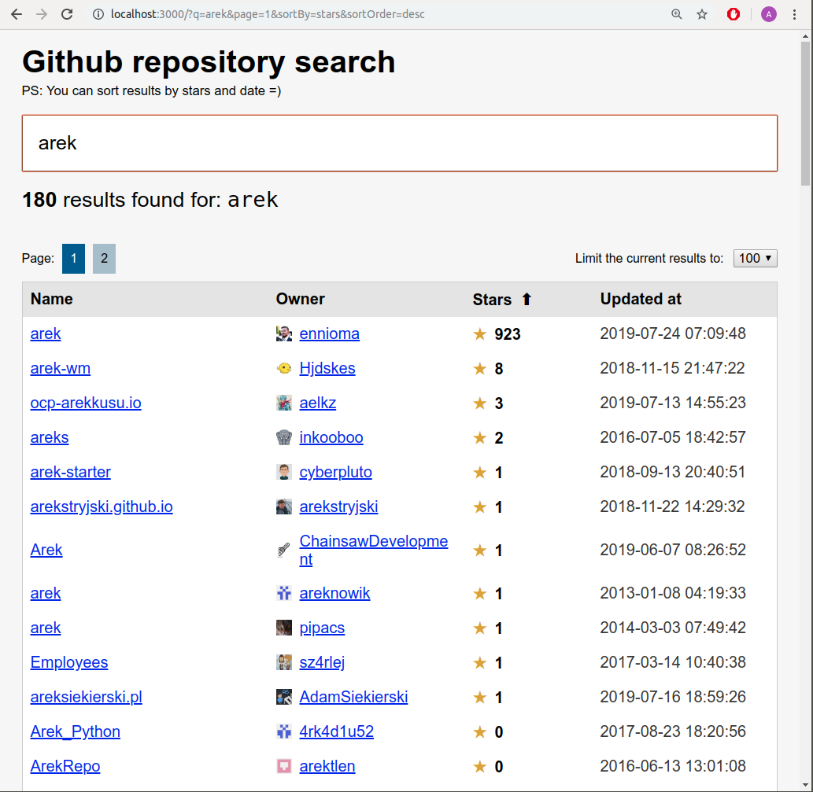

# Tonik assignment

Github repository search.

## Features:

- sorting
- pagination
- true routing - every change is recorded in the history
- in-memory cache (very poor) - as you go back, it's all instant
- unit tests

Missing:

- responsiveness
- proper cache mechanism (I think pushState storage is equally bad)
- better UX
- some additional unit tests

## How to run

It's been simply bootstrapped with create-react-app. So a standard `yarn && yarn start` to run and `yarn test` to test, etc.

## App structure

I've used hooks only, because it felt both challenging and suitable.

The current file structure resembles the "feature pattern" - `RepositorySearch` being one of them, and `components` being a place for reusable (UI) components. With more of files coming, one could group each of the components into a separate folder and put features inside of a new `features` directory. But for now, that sounds like an overkill.

`RepositorySearch/Container` contains the whole state, manipulates it (like a reducer) and spreads it to its children.

This works fine for this project, but to keep it efficient with more features coming, a solution like Redux or simply context API would be required for a cross-feature communication.

## More about the codebase

There are almost no deps, with the exception of `axios`, which possibly could be replaced by an even simpler `fetch` here.

I haven't worried too much about polyfills - it works on the latest Firefox/Chrome. Perhaps one of the features used is too new for a proper compability.

Routing is implemented manually, because I find it very lightweight and not necessarily that harder from using an existing routing library. Of course, that may be true only for the current requirements, which are very small indeed.

Sorting is done on the API side (sadly only 2 fields are an option).

Caching is terrible - just a hashmap of URLs to the coresponding results. I think pushState would run into a similar limitation. But I've seen a lot of great libraries solving this exact issue.

There are no bugs I am aware of! :)
